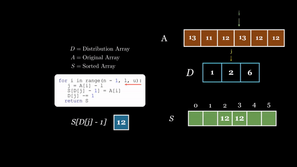

# Distribution Counting Sort with Manim

This repository contains a visualization code of the **Distribution Counting Sort** algorithm using [Manim](https://manim.community/), a mathematical animation engine. The implementation is provided by **Ashraf Hany** as part of the Design and Analysis of Algorithms course **CS312** a total of 78 Hours were spent to develop this video.

Distribution Counting Sort is a sorting algorithm that works efficiently for integers with a limited range. It operates by counting the occurrences of each element and then determining the correct position for each element in the sorted array based on these counts.


<div align="center">
  

[]([https://www.youtube.com/watch?v=YOUTUBE_VIDEO_ID_HERE](https://www.youtube.com/watch?v=TVK_2h5Q1S))

### Watch The Video [Here](https://www.youtube.com/watch?v=TVK_2h5Q1Sc).
</div>


## Introduction

Distribution Counting Sort is a sorting algorithm designed for integers with a limited range. It employs a counting-based approach to efficiently organize elements in ascending order.
This animattion was made for a course project using Manim and Adobe Premiere Pro to insert the music you hear.

## Installation & Usage ⚙️

To set up the required environment, follow these steps:

1. Install Manim by running the following command:

   ```bash
   pip install manim
   ```
    ***Make sure you've installed all of Manim required dependencies like <span style="color:red">LaTeX</span>***

2. Clone this repository:

   ```bash
   git clone https://github.com/AshrafHanyy/Distrubtion_Count_Sort

3. Navigate to the project directory:

   ```bash
   cd YourPath/Distrubtion_Count_Sort

4. Run the Manim animation script:
   ```bash
   manim -pqh sort.py DistributionCountingSort

## Animation Description 🎥

The Manim animation visually demonstrates the Distribution Counting Sort algorithm:

**Array Initialization**: Starts with a visual representation of the unsorted array. 📤

**Frequency and Distribution Arrays**: Illustrates the creation of frequency and distribution arrays, providing insights into the counts of each element. 📈

**Sorting Process**: Shows the step-by-step sorting process, determining the correct positions based on element occurrences. 🔍

Informative Text: Includes informative text to enhance understanding, guiding through the algorithm's key steps. 📝

The animation includes informative text, visualizing the step-by-step process of the algorithm, and highlighting key elements for better understanding.

## Quick Look ▶️

   
